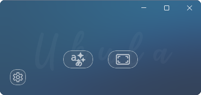
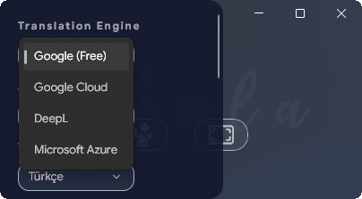
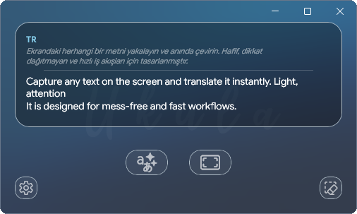
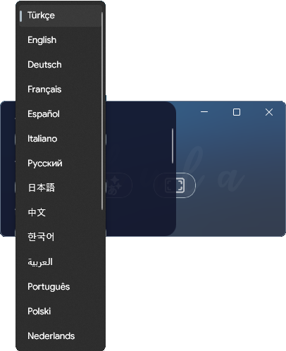

  

<h1 align="center">UKULA</h1>

Fast OCR translation and screenshot pin tool for Windows.

Capture text from anywhere on your screen, translate it instantly, or pin screenshots directly on your desktop while working.

  

---

<h2 align="center">OCR Translation</h2>

  

Select any area on your screen and translate it instantly.

---

<table>
  <tr>
    <td></td>
    <td></td>
    <td></td>
  </tr>
</table>

---

Ukula supports:

* DeepL
* Google Cloud Translate
* Azure Translator
* Google (Free) unofficial API (GTranslate)

⚠️ THESE SERVICES REQUIRE YOUR OWN API KEYS.

Your API key is encrypted and stored locally on this device via Windows Credential Manager; 
it is never sent to external servers, nor is it saved in any file or folder on your computer.

"Google (Free) option uses an unofficial API. 
It may occasionally be rate-limited or unavailable. 
For stable usage, enter your own API key via Google Cloud, DeepL, or Azure."

GTranslate
Copyright (c) 2021 d4n3436
License: MIT License
https://github.com/d4n3436/GTranslate

---

<h2 align="center">Screenshot Pinning</h2>

  

Take a screenshot and pin it directly onto your desktop.

---

Useful for:

* references
* tutorials
* coding
* design work
* comparisons

Pinned screenshots support:

* zoom
* pan
* always-on-top windowing

---

## Why This Exists

Ukula started because I got tired of pointing my phone at my monitor while playing games just to translate text.

Waiting for camera OCR, fighting blurry screenshots, retyping things manually...

Eventually it became easier to build a small desktop tool than continue doing that forever.

---

## ⚠️Windows SmartScreen Warning⚠️

Windows may show a SmartScreen warning when running the installer.

Ukula currently does not use a commercial code-signing certificate because those 
certificates are honestly pretty expensive for a small utility project like this.

The app does not include:

* ads
* telemetry
* or anything like that

---

## Privacy / Terms

* Privacy Policy:
  [Ukula Privacy Policy](https://kursatkd.github.io/ukulaSite/privacy.html)

* Terms of Service:
  [Ukula Terms of Service](https://kursatkd.github.io/ukulaSite/terms.html)

---

## Third-party libraries
- [GTranslate](https://github.com/d4n3436/GTranslate) — MIT License
- [H.NotifyIcon.WinUI](https://github.com/HavenDV/H.NotifyIcon) — MIT License  
- [WinUIEx](https://github.com/dotnet/winui-gallery) — MIT License
- [ZXing.Net](https://github.com/micjahn/ZXing.Net) — Apache 2.0
- [Tesseract OCR](https://github.com/tesseract-ocr/tesseract) — Apache 2.0

---

## Notes

Ukula is developed and maintained by a solo developer.

There may still be rough edges here and there while the app evolves.
